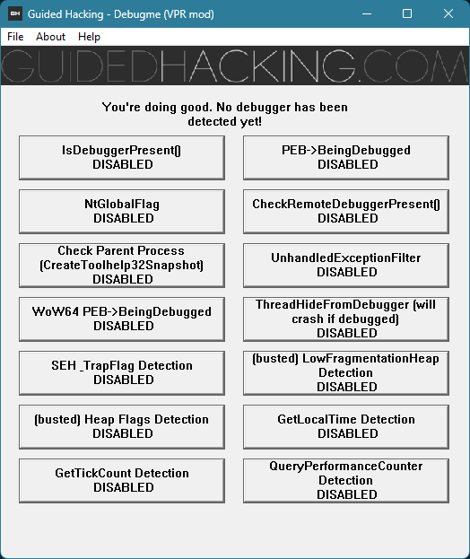

# VPR's x64 MinGW Mod of GuidedHacking - Debugme 

Implementation of some anti-debugging techniques on a (bad looking) Win32 application. The idea is to cover most used anti-debugging methods, so feel free to drop a Pull Request anytime 😏.



### Building (Docker)
Docker
```bash
git clone https://github.com/0xvpr/anti-debugging-mingw-x64/
cd anti-debugging-mingw-x64/
make docker-container
make docker-build
```

Local (requires cmake, nasm, mingw)
```bash
git clone https://github.com/0xvpr/anti-debugging-mingw-x64/
cd anti-debugging-mingw-x64/
make local-build
```

## How to add a new anti debugging method 
1. Create a new file `.h` on the Methods folder with the name of the method. 
2. Implement your anti debugging function on the new file. This function will run on the main loop if enabled. It has to return a `bool` stating if a debugger was detected or not.
2. On `anti-debugging.cpp`, find the lines where it creates instances of `AntiDebugMethod` class on the heap. Create a new instance, passing the pointer to your function, coordinates for the button on the UI and the method name like:
```cpp
    AntiDebugMethod* sixthOne = new AntiDebugMethod(MethodUnhandledException, 270, 220, "UnhandledExceptionFilter");
	sixthOne->createGUI(hWnd);`
```
## TODO
- Fix broken methods
  - [x] WoW64 PEB-\>BeingDebugged
  - [x] SEH Trap Flag Detection
  - [x] PEB-\>BeingDebugged
  - [x] NtGlobalFlag
- Improve methods (not working as intended)
  - [ ] LowFragmentationHeap Detection
  - [ ] Heap Flags Detection
- Development tasks
  - [ ] Add more methods
  - [ ] Change the UI (either make it look good/modern or completely shitty like a Win95 program).
  - [x] Add support for x64 (there were some specifics I would have to deal for a few methods to support x64, and I got lazy to do it on V1).

#### IsDebuggerPresent
This is a Windows API function that is used to check if the current process is being debugged. It returns a non-zero value if the process is being debugged, and zero otherwise. This is a simple and straightforward method of anti-debugging, but it's also easily bypassed by a knowledgeable attacker.

#### PEB>BeingDebugged
The Process Environment Block (PEB) is a data structure in the Windows operating system that contains data related to the currently executing process. The `BeingDebugged` field in the PEB is a flag that is set to true when the process is being debugged. By directly checking this flag, a program can determine if it's being debugged. However, like `IsDebuggerPresent`, this method is relatively easy for an attacker to bypass.

#### NtGlobalFlag
This is another field in the PEB. The `NtGlobalFlag` is used by the system to store various debugging and heap information. When a process is being debugged, certain bits in this flag are set. By checking these bits, a program can determine if it's being debugged. This method is a bit more complex than the previous two, but it can still be bypassed by a skilled attacker.

#### CheckRemoteDebuggerPresent
This is a Windows API function that checks if a specific process is being debugged by a remote debugger. The function takes two parameters: a handle to the process to check, and a pointer to a boolean variable that receives the result. If the process is being debugged, the function sets the boolean to true. This method can be used to detect remote debugging, but like the other methods, it can be bypassed by an attacker who knows what they're doing.

## Original Credits

Big shoutout to everyone at [guidedhacking.com](https://guidedhacking.com) that helped me with the development of this application. It's indeed the best resource to learn game hacking and reverse engineering. You should check it out if you haven't.


Related Anti-debug Tricks​
-------------------------

-   [How to Find Hidden Threads - ThreadHideFromDebugger - AntiDebug Trick](https://guidedhacking.com/threads/how-to-find-hidden-threads-threadhidefromdebugger-antidebug-trick.14281/)
-   [How To Detect Debuggers With Debug Flags](https://guidedhacking.com/threads/how-to-detect-debuggers-with-debug-flags.20393/)
-   [How To Detect Breakpoints - Antidebugging Trick](https://guidedhacking.com/threads/how-to-detect-breakpoints-antidebugging-trick.20374/)
-   [Low Fragmentation Heap - LFH AntiDebug Check](https://guidedhacking.com/threads/low-fragmentation-heap-lfh-antidebug-check.20347/)
-   [Anti-Debug Techniques - Self Debugging](https://guidedhacking.com/threads/anti-debug-techniques-self-debugging.20339/)
